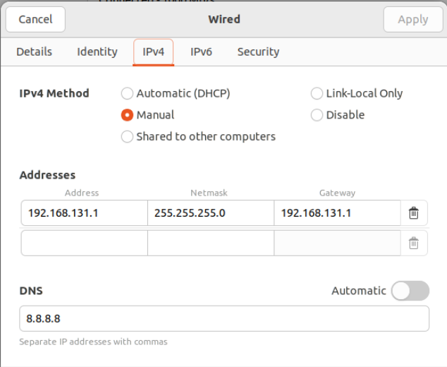

# Project 1

## Network Setting


### Router

### VM (entry)

- Interface 1
    - Bridge
    - DHCP (reserved to `192.168.87.5/24`)


- Interface 2
    - Internal Network
    - `192.168.131.1/24`
    - remember to set DNS to `8.8.8.8` because the default DNS for internal network is `192.168.131.1`, which may be conflicted with the VM IP.




### VM (playground)

setting port forwarding: 


# Requirement

## WAN Connectivity

## SSH

```bash
# SSH Setting
sudo apt-get install openssh-server
sudo systemctl restart ssh.service
service ssh status
```

```bash
# VM (entry)
sudo vim /etc/sysctl.conf

# ---------- #
net.ipv4.ip_forward = 1
# ---------- #

sudo sysctl -p
sudo apt-get install iptables
sudo iptables -t nat -A POSTROUTING -o enp0s3 -j MASQUERADE

# VM (nuclear)
sudo ip route add default via 192.168.131.1
ping 8.8.8.8
```


### WAN to entry

---

```bash
# On WAN PC
# AP IP: 192.168.24.93
ssh ccna@192.168.24.93 -p 1111
```

### host to playground

---

```bash
# On LAN Laptop
ssh ccna@localhost -p 1111
```

### host to nuclear

---

```bash
# On LAN Laptop
ssh ccna@192.168.131.2 -p 22 -J ccna@192.168.87.5:22
```

### WAN to playground

---

```bash
# On WAN PC
ssh playground@192.168.87.10 -p 22
```

### WAN to nuclear

---

```bash
# On WAN PC
# AP IP: 192.168.24.93
ssh -N -L 4700:192.168.131.2:22 ccna@192.168.24.93 -p 1111 # 1st terminal
ssh ccna@localhost -p 4700
```