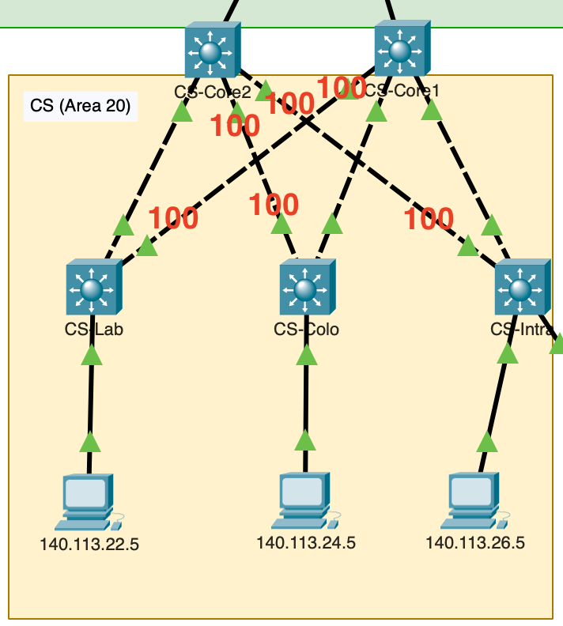

# Project 3

## 1. Advertise Networks

### CS-Core1

```
CS-Core1(config-router)#network 10.0.12.0 0.0.0.3 area 0
CS-Core1(config-router)#network 10.2.11.0 0.0.0.3 area 20
CS-Core1(config-router)#network 10.2.12.0 0.0.0.3 area 20
CS-Core1(config-router)#network 10.2.13.0 0.0.0.3 area 20
```

### CS-Core2

```
CS-Core2(config-router)#network 10.0.13.0 0.0.0.3 area 0
CS-Core2(config-router)#network 10.2.21.0 0.0.0.3 area 20
CS-Core2(config-router)#network 10.2.22.0 0.0.0.3 area 20
CS-Core2(config-router)#network 10.2.23.0 0.0.0.3 area 20
```

### CS-Lab

```
CS-Lab(config-router)#network 10.2.11.0 0.0.0.3 area 20
CS-Lab(config-router)#network 10.2.21.0 0.0.0.3 area 20
CS-Lab(config-router)#network 140.113.22.0 0.0.0.255 area 20
```

### CS-Colo

```
CS-Colo(config-router)#network 10.2.12.0 0.0.0.3 area 20
CS-Colo(config-router)#network 10.2.22.0 0.0.0.3 area 20
CS-Colo(config-router)#network 140.113.24.0 0.0.0.255 area 20
```

### CS-Intra

```
CS-Intra(config-router)#network 10.2.13.0 0.0.0.3 area 20
CS-Intra(config-router)#network 10.2.23.0 0.0.0.3 area 20
CS-Intra(config-router)#network 140.113.26.0 0.0.0.255 area 20
```

## 3. Passive Interface

```
Dorm-10(config-router)#passive-interface gi1/0/2
Dorm-12(config-router)#passive-interface gi1/0/2
```

## 4. Intergate with RIP

```
Med-Core(config)# router ospf 42
Med-Core(config-router)# redistribute rip metric-type 2 subnets 

Med-Core(config)# router rip
Med-Core(config-router)# redistribute ospf 42 metric 1
```

## 5. Stub Area

```
Dorm-B3(config-router)# area 40 stub
Dorm-G1(config-router)# area 40 stub

YM-Dorm-Core(config-router)# area 40 stub no-summary

Med-FooLab(config-router)# area 30 nssa

Med-Core(config-router)# area 30 nssa no-summary
```

## 6. Cost

```
CS-Core1(config)# int gi1/0/2
CS-Core1(config-if)# ip ospf cost 100

CS-Core2(config)# int r gi1/0/3 - gi1/0/4
CS-Core2(config-if)# ip ospf cost 100

CS-Lab(config)# int gi1/0/1
CS-Lab(config-if)# ip ospf cost 100

CS-Colo(config)# int gi1/0/2
CS-Colo(config-if)# ip ospf cost 100

CS-Intra(config)# int gi1/0/2
CS-Intra(config-if)# ip ospf cost 100
```



讓不想要走的 link 的 Cost 變很高，要兩端的 interface 都設定才有用。

## 7. Debug YM-Dorm


## 8. Debug Med (10%)


```
**clear ip ospf process**
```

重開後就好了